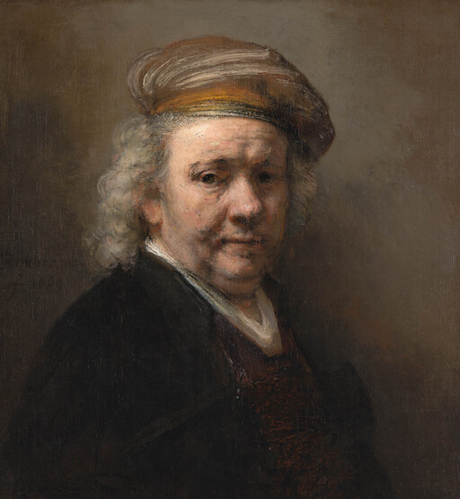
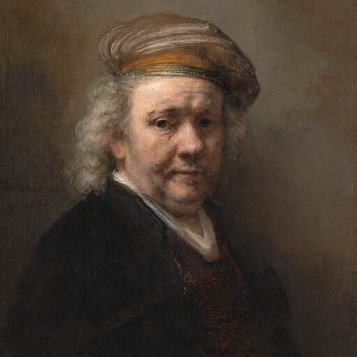
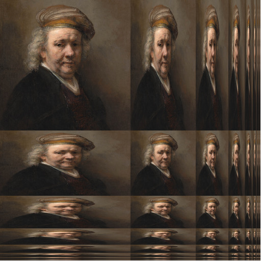

# swift-anisotropic
Swift program to make a 512x512 ppm in anisotropic format from a given image. 

The first step is to resize the input image to a intermediate square 512x512 image by taking the smallest of either height or width and resize it to 512 pixels. The longer of the two will be cut down (center gravity) to fit 512 pixels. The next step is to resize this square image to 256x256, 256x128, 256x64, etc.

Usage:

```shell
swift main.swift <input image>
```

This is an example:

input image:



intermediate 512x512 image:



output image:




